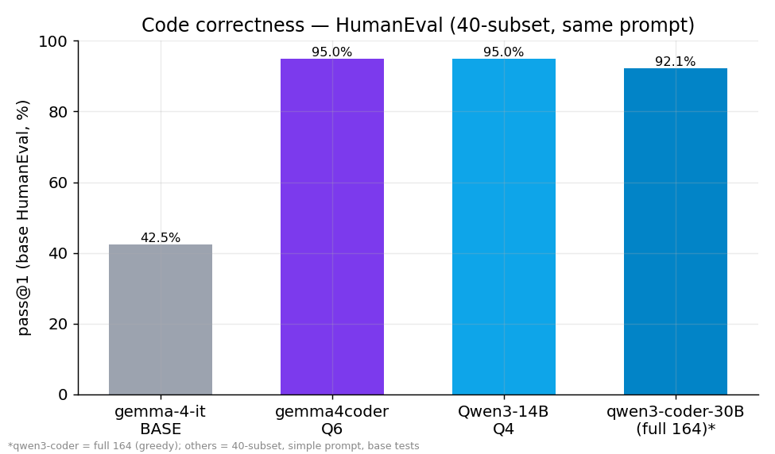
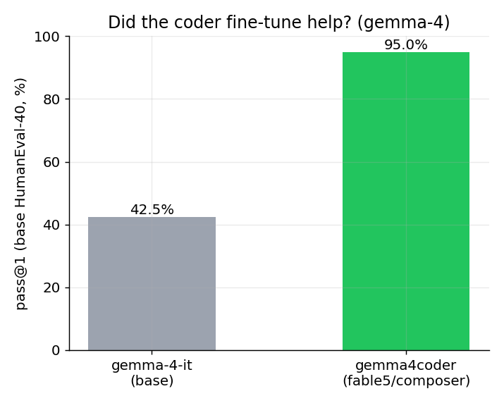
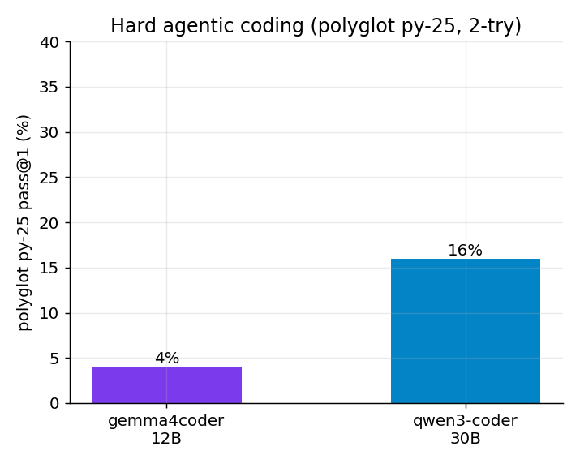

# Coding correctness matrix — base vs fine-tune, dense vs MoE, easy vs hard

All measured on the **RTX 5060 Ti 16 GB**. HumanEval comparison uses the **same 40-problem subset, same simple prompt, same base-test scorer** across models (qwen3-coder shown at its full-164 number for reference).

## HumanEval (base tests, 40-subset)
| Model | pass@1 | notes |
|---|---:|---|
| **gemma-4-12B-it** (BASE) | **42.5%** | ⚠️ 10/40 empty — the base over-thinks past the token budget; attempted-only ≈ 57% |
| **gemma4coder** Q6 (fable5/composer) | **95.0%** | 0 empty |
| **Qwen3-14B** (dense) | **95.0%** | 0 empty |
| **qwen3-coder-30B** | 92.1% | *(full 164; HumanEval+ = 89.0%)* |

### Finding 1 — the coder fine-tune helps a LOT
**gemma-4-12B-it base 42.5% → gemma4coder 95.0%** on the *same* problems. The fable5/composer training is a big, real win for isolated-function coding (even being generous to the base's empties, ~57% → 95%).

## Polyglot (hard agentic coding) — OFFICIAL Aider harness, cross-validated
**Official Aider polyglot** (Python split, 34 exercises, "whole" format, 2 tries with test feedback — the standard benchmark.py harness):
| Model | pass@1 (2-try) | 1st try |
|---|---:|---:|
| **qwen3-coder-30B** | **17.6%** (6/34) | 5.9% |
| **gemma4coder-12B** | **≈0–3%** \* | — |

**Cross-validated — the number is real, not a harness artifact.** Three independent measurements agree:
- Official Aider harness: **17.6%** (qwen3-coder) / 2.9% (gemma4coder)
- Our quick custom harness: 16% / 4% (matches within noise)
- Community report: ~18.7% for a Q2 quant on the full polyglot

### Finding 2 — easy ≠ hard, and on hard problems size matters
Both coders **ace HumanEval (~95%)** but the official Aider polyglot confirms **~17.6% (30B)** and **~2.9% (12B)** on hard exercism problems — the **30B is ~6× the 12B** despite tying on HumanEval. This is the **local-vs-frontier gap**: frontier models hit 60-88% on Aider polyglot; a local 30B Q4 manages ~18%, a 12B ~3%.

> Methodology note: the official Aider leaderboard uses the **"diff"** format; this run used **"whole"** (more reliable for small models, and matches the community local-test methodology we calibrated against). **Python-only** (the harness's 34 Python exercises), not the full 225-exercise / 6-language polyglot — so a rough local lower bound, not a 1:1 leaderboard entry.
>
> \* **gemma4coder-12B is near-zero on hard polyglot — and over-reasons pathologically.** Two runs pin it down:
> - **ctx 8192:** 2.9% (1/34), but **13/34 errored on context overflow** (the 2-try prompts blew past 8192).
> - **ctx 32K (clean, no overflow):** **0/11** on the first 11 before we stopped it — the model emitted **~18,000-token "thinking" responses** per hard exercise (~15 min each → a full run = many hours) and still failed every one.
>
> So gemma4coder ≈ **0–3%** on hard Python polyglot — and a notable trait of this fine-tune surfaces: it **over-reasons** on hard problems (giant thinking blocks) yet doesn't solve them, which also makes it impractical to bench at full context. The **qwen3-coder run was clean** (0 errors, no over-thinking — it's a non-thinking instruct coder). The **30B ≫ 12B** conclusion is robust across all measurements.

## Caveats (read before quoting)
- HumanEval is saturated / contamination-prone; this is a **40-subset**, **base** tests (not HumanEval+).
- The **gemma-4-it base** empties (over-thinking) drag its number; even attempted-only (~57%) is far below the coders.
- Polyglot here is a **Python-25 direct-generation** subset, **not** the official Aider Polyglot (225 ex, 6 langs, search/replace) → a rough local lower bound, not leaderboard-comparable.
- Runtimes differ (llama.cpp for gemma-4-it / gemma4coder / Qwen3-14B; ollama for qwen3-coder). Greedy/temp-0 for HumanEval; temp 0.2 for polyglot.
