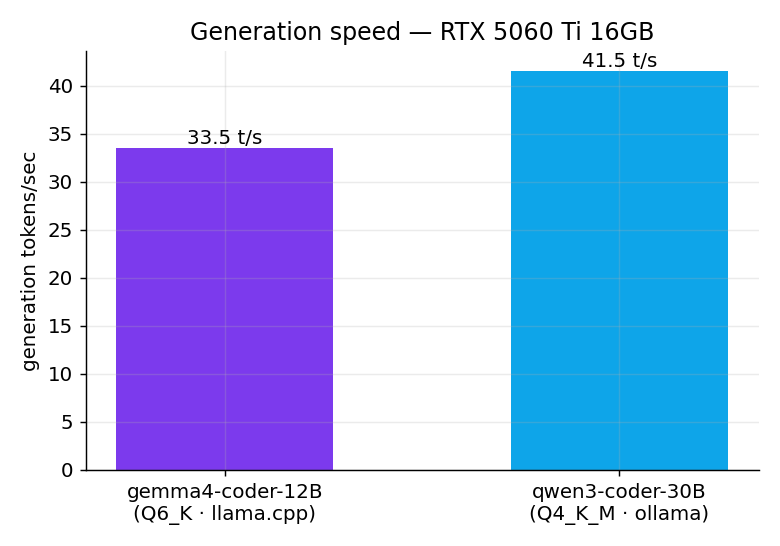
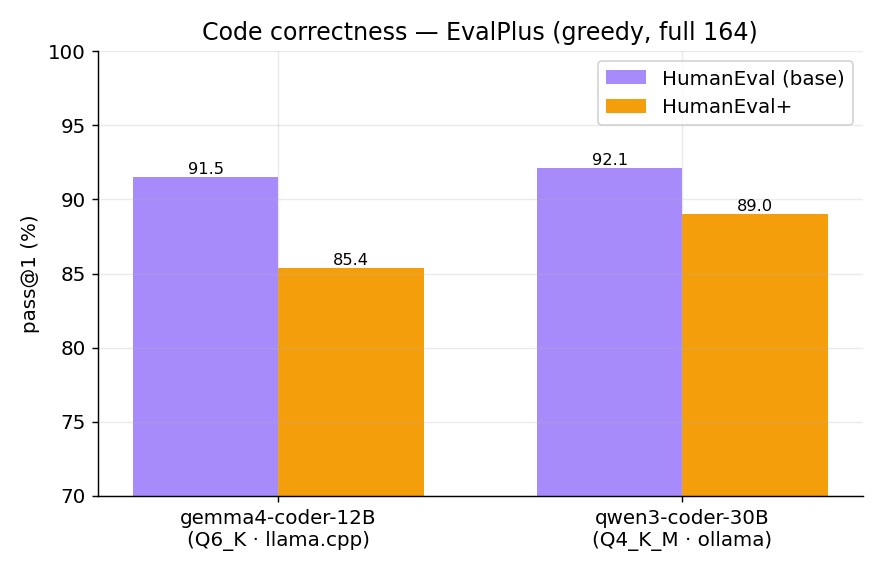
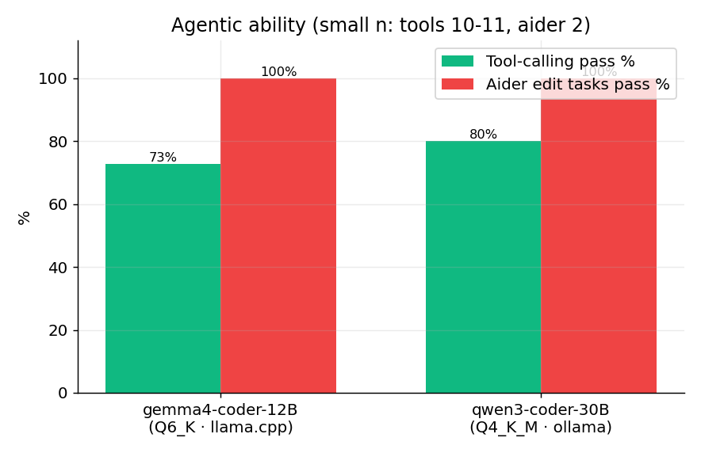

# local-llm-coding-eval

A **personal testing framework** for evaluating local coding LLMs as **agent backends** on consumer hardware. No fine-tuning here — these are **direct, independent tests of the original published models**, run end-to-end on one machine with open, reproducible scripts.

> Validated stack so far: **WSL2 + llama.cpp + ollama** on an **RTX 5060 Ti 16 GB** (Blackwell). One model at a time, full GPU.
>
> 🛠️ **Exact versions (Python, CUDA, driver, llama.cpp build, ollama) + the Blackwell/WSL2 setup gotchas → [ENVIRONMENT.md](ENVIRONMENT.md).**

## Why this exists
"HumanEval 90%" tells you almost nothing about whether a model can *drive a coding agent*. So this framework measures four things that actually matter for agentic use, on hardware people actually own:
1. **Speed** (tokens/sec on a 16 GB card)
2. **Code correctness** (EvalPlus HumanEval / HumanEval+)
3. **Tool-calling** (does it emit valid `tool_calls`?)
4. **Real edit loop** (Aider search/replace on actual files)

## Hardware
| | |
|---|---|
| GPU | NVIDIA RTX 5060 Ti **16 GB** (Blackwell, sm_120) |
| CPU / RAM | Ryzen 5 7600X · 16 GB DDR5-4800 |
| OS | Windows 11 + **WSL2 (Ubuntu)** |
| Engines | llama.cpp (CUDA sm_120, `98d5e8b`) · ollama 0.17.7 |

## Models in this framework (original, unmodified)
5 models live locally on this box. Coverage so far — the detailed coding results below are for the two **coders**:

| Model | Quant · runtime | Type | Coding-agent eval | Vision |
|---|---|---|---|---|
| **gemma-4-12B-it** (base) | Q4_K_M · llama.cpp | text **+ vision** | ⏳ planned | ✅ [VISION.md](VISION.md) |
| **gemma-4-12B-coder** (fable5/composer) | Q6_K / Q8_0 · llama.cpp | reasoning coder | ✅ done | ❌ text-only |
| **Qwen3-Coder-30B-A3B** | Q4_K_M · ollama | MoE (~3 B active) | ✅ done | ❌ text-only |
| **Qwen3-14B** | Q4_K_M · llama.cpp | dense | ⏳ planned | ❌ text-only |

> A standardized **speed + prompt-processing + context-scaling** benchmark across all 5 (plus an Aider-polyglot subset) is queued — see [Roadmap](#roadmap).

---

## Results

### 1. Generation speed


The 30B is **faster** than the 12B despite spilling 25% to CPU — it's MoE-A3B (~3 B active/token), so offloaded experts rarely fire. "Offload = slow" is a *dense*-model rule, not a MoE one.

### 2. Code correctness — EvalPlus (greedy, full 164, official `evalplus.evaluate`)


| Model | HumanEval (base) | HumanEval+ |
|---|---|---|
| gemma4-coder-12B (Q6_K) | 91.5% | 85.4% |
| Qwen3-Coder-30B (Q4_K_M) | **92.1%** | **89.0%** |

### 3. Agentic ability


- **Tool-calling** (OpenAI `tools`, 10–11 hand-written scenarios): gemma 8/11, qwen 8/10. Both: correct selection, valid JSON args, enums, parallel calls, abstention, multi-turn. gemma's misses were "look before leap" (e.g. `ls` before `pytest`); qwen's were `write_file` emitted as `<function=>` text that ollama didn't parse.
- **Aider edit loop** (search/replace, 2 real tasks): **both 2/2** — valid `SEARCH/REPLACE` blocks applied and verified by running the code.

## Verdict (16 GB card)
- **Qwen3-Coder-30B is the better agent backend** — faster *and* more correct, purpose-built for tool-use. Cost: eats the whole GPU (~0 free), ~48 s load.
- **gemma4-coder-12B Q6** wins when you want the GPU mostly free (~5 GB headroom), instant load, or a reasoning style.

## ⚠️ Honest caveats (read before quoting)
- **HumanEval is saturated / contamination-prone.** ~90% = "clears the bar," not elite. The **Aider live tasks** (novel, hand-written) and tool-calling are the more trustworthy signals here.
- **Greedy pass@1**, not vendors' official eval settings — not directly comparable to model-card numbers.
- Tool/Aider samples are **small** (10–11 + 2). Directional, not definitive.
- **Different runtimes** (llama.cpp vs ollama) — a confound; sampling was greedy for EvalPlus on both.
- **No SWE-bench / Aider-polyglot** here. On those, both sit far below frontier models. Local value = cheap + private + parallel, not frontier-level reasoning.

## Reproduce
```
results/<model>/   # scores, logs, generated samples, raw run output
scripts/           # the exact eval scripts used
graphs/            # charts
COMPARISON.md      # detailed side-by-side
```
Eval tooling: `evalplus` + `aider 0.86` in a dedicated venv. Serving flags and per-model details are in `COMPARISON.md` and each script's header.

## Roadmap
Planned / in progress (lands as **measured** data, never estimates):
- **Speed + prompt-processing + context-scaling** (tg vs depth 0/4K/16K/32K) for all 5 local models — `scripts/bench_speed_context.sh`.
- **Max context that fits** on 16 GB per model.
- **Aider-polyglot** subset (~25 exercises) on the top model(s).
- Charts for the above.

Bonus (already verified, off the coding theme): the base **gemma-4-12B-it** also does **vision** → [VISION.md](VISION.md).

---
*Personal project — measurements taken 2026-06-20 on the hardware above. Not affiliated with the model authors. PRs/issues with other hardware welcome.*
