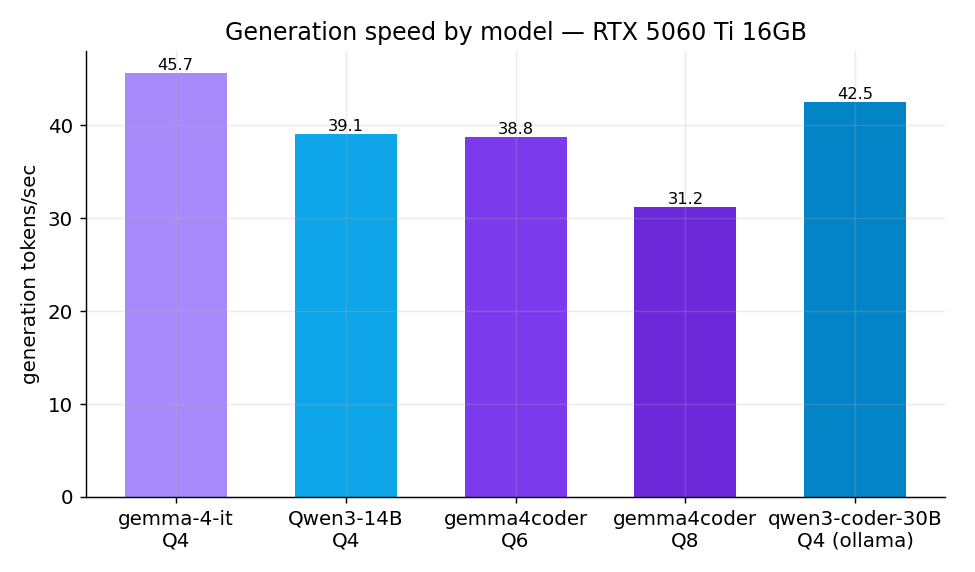
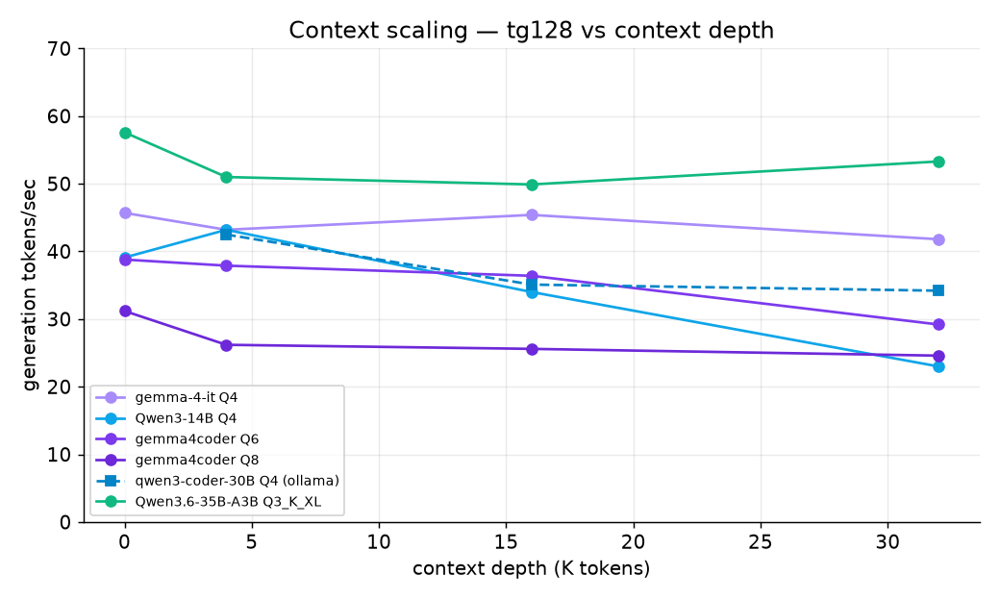
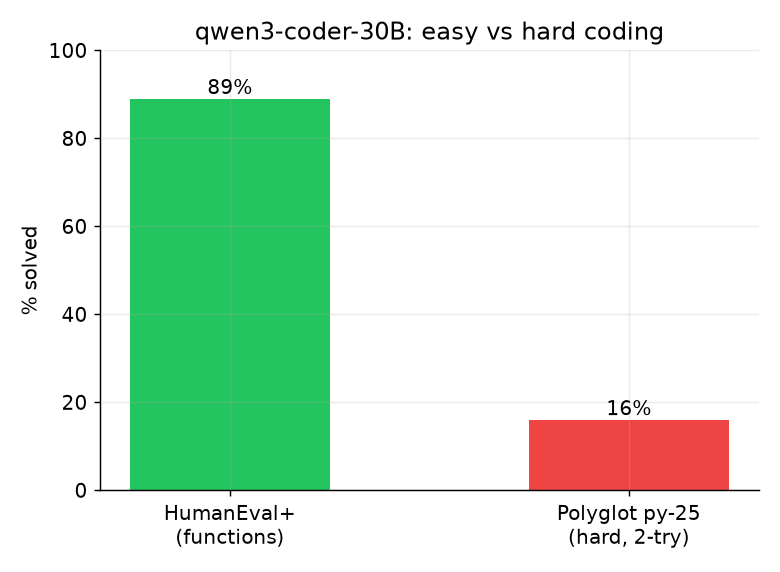

# Speed & context-scaling — 5 local models (RTX 5060 Ti 16 GB)

Measured via `llama-bench` (q8_0 KV cache, `-ngl 99`, flash-attn) for the 4 models that fit fully on GPU; **qwen3-coder-30B** (18 GB MoE) via ollama `num_ctx` sweep. All numbers = **tokens/sec** on this box. Script: `scripts/bench_speed_context.sh`.

**Update (2026-06-27):** added **Qwen3.6-35B-A3B** (Q3_K_XL, MoE-A3B) — measured on a newer llama.cpp build (`5c7c22c`, sm_120) with expert offload (`-ngl 99 --n-cpu-moe 14 -fa on`, default f16 KV). See its own section below for config, the cold-start variance note, and the serve caveat.

## Generation (tg128) + prompt processing (pp512), by context depth
| Model | quant · runtime | pp512 | tg @0 | tg @4K | tg @16K | tg @32K |
|---|---|---:|---:|---:|---:|---:|
| **gemma-4-12B-it** (base) | Q4 · llama.cpp | 2153 | 45.7 | 43.2 | 45.4 | **41.8** |
| **Qwen3-14B** (dense) | Q4 · llama.cpp | 2108 | 39.1 | 43.2 | 34.0 | **23.0** |
| **gemma4coder** | Q6 · llama.cpp | 1875 | 38.8 | 37.9 | 36.4 | 29.2 |
| **gemma4coder** | Q8 · llama.cpp | 1381 | 31.2 | 26.2 | 25.6 | 24.6 |
| **qwen3-coder-30B** | Q4 · ollama (MoE) | – | – | 42.5 | 35.1 | 34.2 |
| **Qwen3.6-35B-A3B** | Q3_K_XL · llama.cpp (MoE) | ~1000\* | 57.6 | 51.0 | 49.9 | 53.3 |

### Takeaways
- **gemma-4-12B-it is the fastest *and* flattest** under context growth (45.7 → 41.8 t/s from 0 → 32 K) — best "fast daily driver."
- **The dense Qwen3-14B degrades the most with context** (39 → 23 t/s) — dense KV cost bites hard at depth.
- **qwen3-coder-30B (MoE)** holds 34–42 t/s; the drop with depth is the KV cache pushing more onto CPU.
- **Q6 vs Q8 (gemma4coder):** Q6 ≈ 25–30 % faster than Q8 at every depth — another reason Q6 is the daily pick.
- **Qwen3.6-35B-A3B (MoE-A3B) is the fastest coder-grade model here** — tg ~53–57 t/s, **nearly flat 0 → 32 K** (57.6 → 53.3), pp ~1000 t/s (warm). It's **35 B (bigger than the 30B) yet faster**: only ~3 B activate per token and most experts sit on GPU, so the ~4 GB offloaded to CPU rarely fire. ⚠️ Cross-runtime caveat — this is **llama.cpp**, the 30B above is **ollama**.

### Context that fits
The precise max-context probe (`llama-cli`) proved flaky (hung on load) and was dropped. From the **real** `llama-bench` runs, all 4 GPU models executed tg128/pp512 at **depth 32 K** with `-ngl 99` + q8 KV → **all ≥ 32 K fully on GPU**. Higher is a VRAM-math estimate (Q6 ≈ 64 K+, Q8 tighter).

## Qwen3.6-35B-A3B (MoE-A3B) — config & caveats
- **Why it fits 16 GB:** Q3_K_XL is **15.7 GB** (declares arch `qwen35moe`). With `-ngl 99 --n-cpu-moe 14`, ~11.8 GB of weights sit in VRAM and ~4 GB of expert tensors on CPU RAM; being MoE-A3B (~3 B active/token) the CPU-resident experts rarely fire, so generation stays fast. Lower `--n-cpu-moe` → more experts on GPU → faster, but tighter VRAM (≈4.9 GB free at ncmoe 18, ≈4.2 GB at ncmoe 14).
- **\* pp ≈ 1000 t/s is the warm value.** The variance in earlier runs was **cold-start, not load**: depth-0 pp512 measures cold (562 ± 378); once warm (depth ≥ 4 K) pp is a steady ~985–1065 t/s and tg is rock-solid (±<1 at d0 and d32K). The mid-depth tg ±14 is the same warm/cold expert paging.
- ⚠️ **Serve hang (open issue):** `llama-server` on this build (`5c7c22c`) **hangs while loading** this model with mmap + `--n-cpu-moe` (VRAM frozen ~1 GB, no progress for 2+ min — the **port is open**, `/health` returns 503 "Loading model", so it's not a connection issue). `--no-mmap` reaches ~11.8 GB VRAM then stalls (15.7 GB model > 12 GB WSL RAM). `llama-bench` is unaffected (loads + runs in one shot), which is why these are **bench** numbers. An interactive server needs more WSL RAM (`.wslconfig`) or a quant that fits fully in VRAM. Also pass `-fit off` — the new build's auto-fit adds a slow probe step.
- ❌ **Not yet measured for 3.6:** correctness (HumanEval+), tool-calling, polyglot — those require a working server.

## Polyglot (hard agentic coding) — qwen3-coder-30B
Python split, 25 exercism exercises, **direct generation, canonical 2-try with test-error feedback**, temp 0.2: **4 / 25 (16 %)**.

- **Genuine difficulty, not a harness artifact** — verified the failed solutions are *complete* (no truncation), failing on real logic / exact-API / error-message / edge-case mismatches (e.g. wrong exception text, dict-vs-list return, fold arg order). Most stayed failed even with the test error fed back on try 2.
- **The headline contrast:** the same model scores **89 % on HumanEval+** (isolated functions) but **16 %** on these harder exercism problems — a clean illustration of the **local-30B-vs-frontier gap** on hard agentic coding.
- ⚠️ **Not the official Aider Polyglot** (225 exercises, 6 languages, search/replace edits). This is a **Python-only 25-exercise direct-generation** subset → a rough local lower bound, **not** directly comparable to the public leaderboard.
- 1-shot reference (no retry): also 4/25 (`results/polyglot/qwen_polyglot_1shot.txt`); temp 0.2 adds run-to-run variance.
